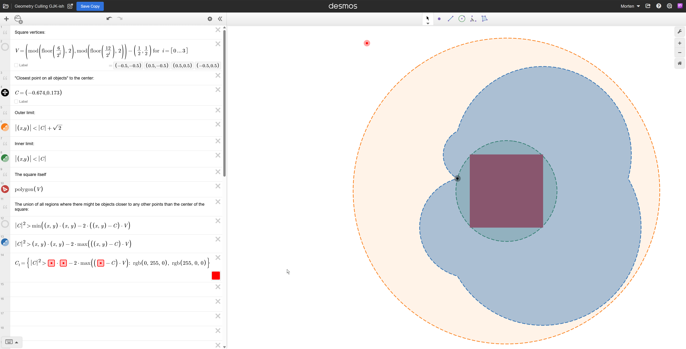
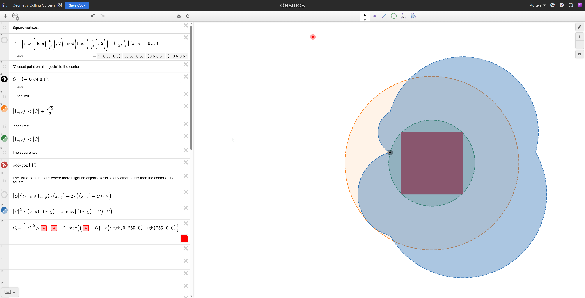

# Geometry Culling with GJK-Inspired Bounds

This document describes a conservative culling technique for spatial queries, visualized using a unit square as the reference shape.

**Interactive version**: [Desmos geometry link](https://www.desmos.com/geometry/089j0ubebw) — drag point C to explore how the bounds change.

## Setup

**Components:**

- **The square**: A unit square with vertices at (±0.5, ±0.5), centered at the origin
- **Point C**: The closest point to the origin (center of the square) found among *other objects* being tested — not a point on the square itself. In this example, C = (−0.674, 0.173), which lies outside the square.
- **Inner limit**: A circle of radius |C| centered at the origin
- **Outer limit**: A circle of radius |C| + √2 centered at the origin, where √2 is the full diagonal of the unit square (corner to opposite corner)

## Culling Logic

The inner and outer circles enable fast accept/reject decisions when testing whether other objects might contain points closer to the center than C:

| Test | Condition | Conclusion |
|------|-----------|------------|
| **Inner** | *Any* point of an object falls inside the inner circle | That point is closer to the center than C — a better candidate exists |
| **Outer** | The *entire* object lies outside the outer circle | No point on that object can be closer to the center than C — safe to reject |

Note the asymmetry:
- The inner test requires only partial intersection (one qualifying point suffices)
- The outer test requires complete exclusion (the entire object must be outside)

## The Uncertain Region (Blue)

The blue shaded region represents locations where an external object might be closer to some non-center point inside the square than to the center itself. Objects in this region cannot be trivially accepted or rejected — they require more detailed testing.

This is where the GJK-inspired support function calculations come in, using dot products against the square's vertices to determine tighter bounds.

## Why the Full Diagonal?

The outer limit uses √2 (the full diagonal), not √2/2 (the half-diagonal). This is critical for correctness.

When using the half-diagonal (√2/2 ≈ 0.707), the outer circle becomes too small. The blue "uncertain" region extends beyond the orange boundary, meaning objects in that overflow area would be incorrectly rejected despite potentially containing closer points.

The full diagonal √2 accounts for the maximum extent of the square — the distance from one corner to the opposite corner. This guarantees that any object entirely outside the outer circle truly cannot contain a point closer to the center than C.

## Multi-Level Filtering

The circles are the coarsest bounds — the first pass in a hierarchy of increasingly tight (and expensive) tests:

| Level | Test | Cost | What it filters |
|-------|------|------|-----------------|
| 1 | Outer circle (|C| + diagonal) | Very cheap (one distance) | Definitely-too-far objects |
| 2 | Blue region boundary (support functions) | Cheap (few dot products) | Objects outside the tighter bound |
| 3 | Full GJK / exact test | Expensive | Only for objects in the uncertain region |

Most objects are filtered at level 1. Survivors face level 2. Only objects that pass both require expensive exact computation.

## Generalization to Other Convex Shapes

This technique applies to any convex shape, not just squares. The components adapt as follows:

### Outer Circle Radius

The outer radius is |C| + d, where d is the **diameter** of the shape (maximum distance between any two points), not the radius from center to boundary.

| Shape | Diameter (d) |
|-------|--------------|
| Unit square (vertices at ±0.5) | √2 |
| Circle of radius r | 2r |
| Rectangle with dimensions a × b | √(a² + b²) |
| Regular polygon | 2 × circumradius |
| Arbitrary convex shape | max distance between any two points |

Using the radius instead of the diameter would underestimate the bound and cause incorrect culling, as demonstrated in the √2 vs √2/2 comparison above.

### Support Functions

The blue region computation relies on support functions — a standard primitive for convex shapes that returns the farthest point in a given direction:

| Shape | Support function for direction **d** |
|-------|--------------------------------------|
| Convex polygon | Vertex with maximum dot product against **d** |
| Sphere (center **c**, radius r) | **c** + r × normalize(**d**) |
| Capsule | Endcap center closest to **d**, plus radius × normalize(**d**) |
| Ellipsoid | Closed-form involving the axes |

For polytopes, the cost scales with vertex count (one dot product per vertex, or faster with hill-climbing for high vertex counts). For smooth shapes like spheres and ellipsoids, support is O(1).

The algorithm structure remains identical regardless of shape — only the support function implementation and diameter constant change.

## Hierarchical Application

Consider a concrete problem: computing the closest distance from 100,000 particles to each voxel in a 32×32×32 grid.

**Naive approach**: 32³ × 100k = ~3.3 billion distance calculations.

**Hierarchical approach**: Apply the culling technique at the coarsest level first, then refine.

### Coarse Culling

Treat the entire 32×32×32 grid as a single bounding cube:

1. Find the closest particle to the cube's center
2. Cull all particles outside |C| + (cube diagonal)
3. Most of the 100k particles are eliminated in this single O(particles) pass
4. Test survivors against the 8 corners (support functions) to cull further

Only the surviving particles — likely a small fraction of the original 100k — proceed to per-voxel testing.

### Recursive Refinement

The chunk size is arbitrary. Instead of jumping straight to per-voxel, subdivide recursively:

1. **128³ chunks**: Cull particles against each chunk's bounding volume
2. **32³ sub-chunks**: For survivors, subdivide and cull again
3. **8³ sub-sub-chunks**: Repeat
4. **Per-voxel**: Final pass on the small surviving set

A particle culled at the 128³ level is never tested at any finer level within that region. The culling cascades — each level reduces the working set before it fans out to the next subdivision.

### Complexity

For particles spread across a large world with the grid covering a small region:

- **Coarse culling**: O(particles) — one pass, most eliminated
- **Per-voxel pass**: O(voxels) × (small constant based on local particle density)

The two dimensions decouple. Instead of O(particles × voxels), the problem becomes two linear passes. The constant factor in the per-voxel pass depends on how many particles survive into the grid's bounding volume — typically a tiny fraction of the total.

### Sparse Grids

The 32×32×32 grid could itself be one tile in a much larger sparse structure. Tiles far from any particles are trivially culled at the coarsest level (zero survivors, no per-voxel work). The technique slots naturally into sparse voxel representations — it's the filter you run before committing to per-voxel computation within any tile.

## Caveats

1. **Shape-dependent bounds**: The √2 factor is specific to a unit square. Other convex shapes would require their own maximum extent calculation (e.g., diameter of a bounding circle, or maximum distance between any two points on the shape).

2. **Conservative, not tight**: These circular bounds are intentionally loose. The actual region where closer points might exist (the blue area) has a more complex shape determined by the support function calculations. The circles provide cheap early-out tests before falling back to more expensive exact tests.

3. **Reference point matters**: C must be the closest point to the center among all objects considered so far. If C is misidentified or measured from the wrong reference, the entire culling logic breaks down.

4. **Center of the square as origin**: This visualization assumes the square is centered at the origin, which is also the reference point for all distance calculations. Translating the square would require adjusting the coordinate system accordingly.
